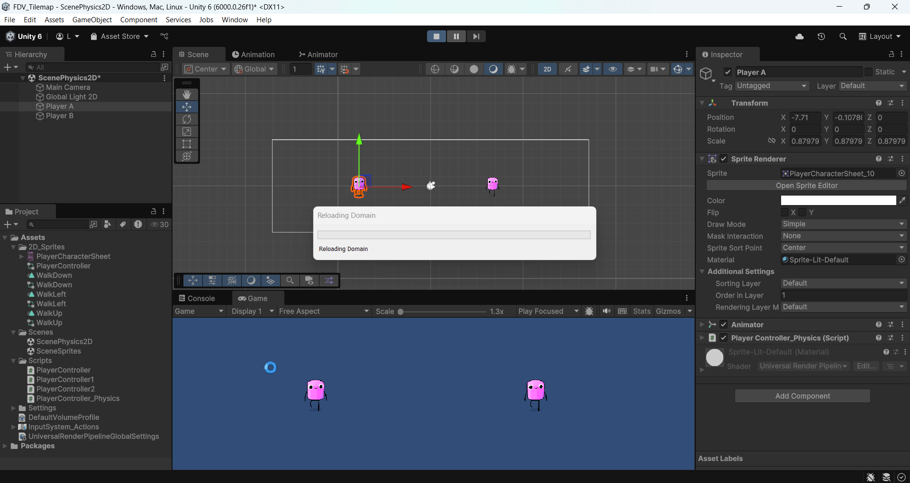
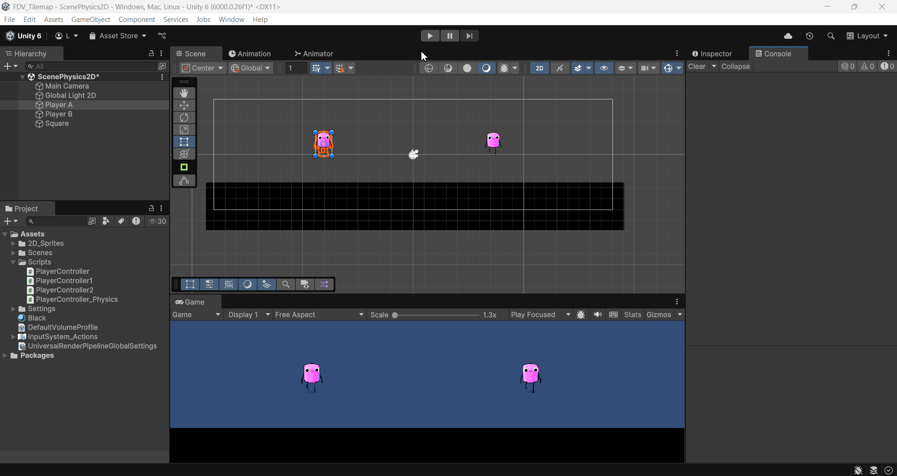
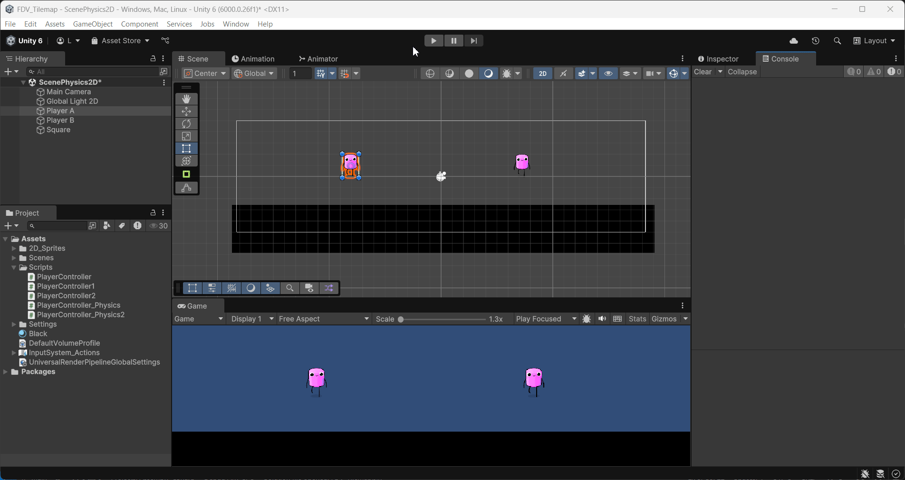
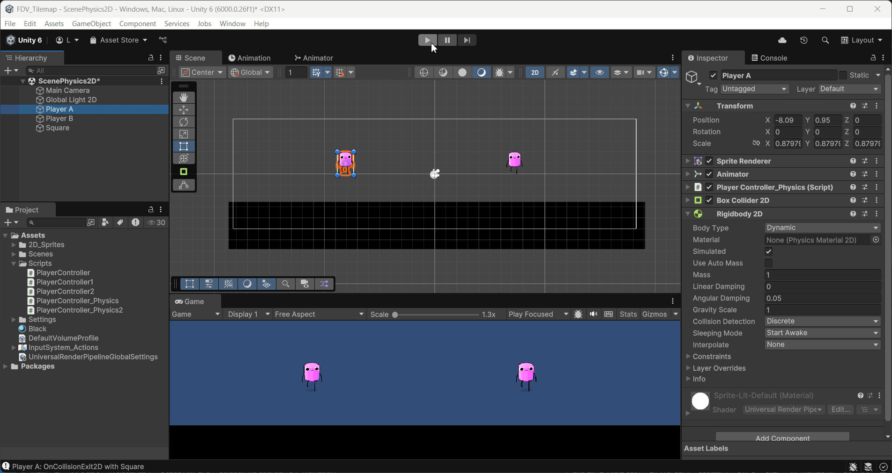
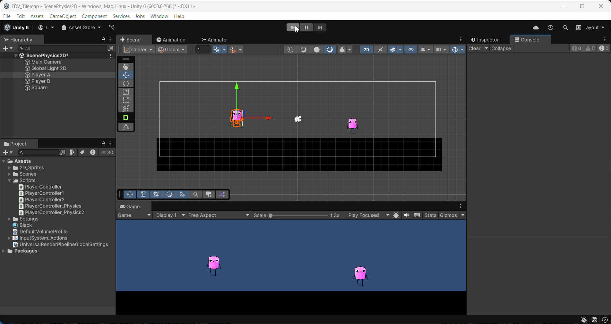
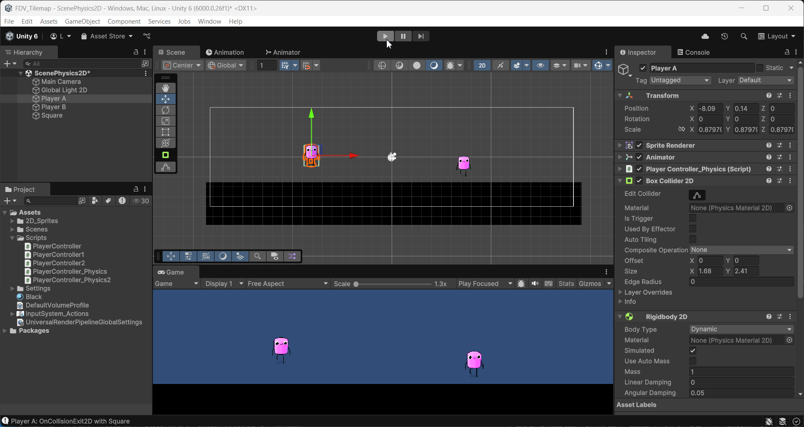
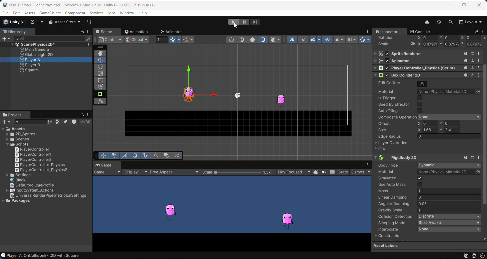
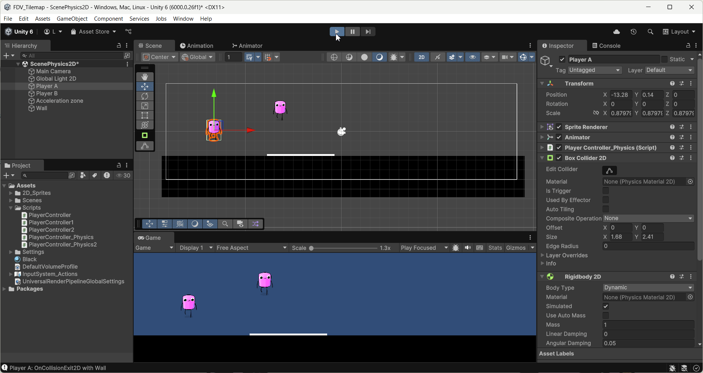

FDV_Tilemaps

```
>> PRACTICA:   Unity Project Tilemaps
>> COMPONENTE: XueMei Lin
>> GITHUB:     https://github.com/XueMei-L/FDV_Physics_Tilemaps.git
>> Versión:    1.0.0
```

# Objetivo
En esta actividad realizaremos pruebas con el motor de físicas 2D y el editor de mapas 2D que proporciona Unity. Los componentes de mayor interés son：

- Rigidbody: Acceso a las simulaciones físicas
- Collider: Detección de las colisiones.


Respecto al mapa de juego, se debe trabajar con los objetos:

- Grid
- Tilemap
- Tile Palette
- Tile map collider
- Composite collider
  
# Proceso de la práctica Tilemaps (Unity)

Reutilizamos el proyecto anterior 2D, creamos otra escena llamado `ScenePhysics2D` para la practica de Tilemaps, además duplicamos nuestro objeto para probar diferentes configuraciones de objetos
físicos en Unity.


## Caso A. Ninguno de los objetos será físico.
Configuración de personajes:
- Persona A, tiene un script de movimiento (incluye códigos de eventos **OnCollision2D** y **OnTrigger2D**)
- Persona B, nada de script
- Ninguna configuración de **Rigidbody** y **Collider**

Resultado:

| Objeto   | Rigidbody2D | Collider2D | Reacción física | Eventos |
|-----------|--------------|-------------|------------------|----------|
| PersonA   | NO           | NO          | NO               | NO       |
| PersonB   | NO           | NO          | NO               | NO       |

Resultado en git:

Hice una configuración de **Persona A** -> **Inspector** -> **Sprite Renderer** -> **Order in Layer** -> cambiar valor a 1 (para tener la visualización de mayor prioridad)




## b. Un objeto tiene físicas y el otro no.
| Objeto   | Rigidbody2D | Collider2D | Reacción física | Eventos |
|-----------|--------------|-------------|------------------|----------|
| PersonA   | SÍ           | SÍ          | SÍ               | SÍ       |
| PersonB   | NO           | NO          | NO               | NO       |

Añadir Box Collider 2D y Rigibody 2D a Player A.


Resultado en gif:
Se puede ver que cuando el personaje tiene fisica, se cae y choca con el suelo, el comando muestra mensaje -> (la funcion **OnCollision2D**)

Código añadido para dos jugares a parte de la práctica anterior (2D Sprites)
```
private void OnCollisionEnter2D(Collision2D collision)
    {
        Debug.Log($"{name}: OnCollisionEnter2D with {collision.gameObject.name}");
    }

    private void OnCollisionExit2D(Collision2D collision)
    {
        Debug.Log($"{name}: OnCollisionExit2D with {collision.gameObject.name}");
    }

    private void OnTriggerEnter2D(Collider2D other)
    {
        Debug.Log($"{name}: OnTriggerEnter2D with {other.name}");
    }
    private void OnTriggerExit2D(Collider2D other)
    {
        Debug.Log($"{name}: OnTriggerExit2D with {other.name}");
    }
```


## c. Ambos objetos tienen físicas.
Añadimos Collider 2D y Rigibody 2D al persona B.


Resultado: Se puede ver que ambos tienes fisicas y se caen encima del muro. Si el jugador A colliona con el jugador B, se puede empujar el jugar, no se puede atravezar.

| Objeto   | Rigidbody2D | Collider2D | Reacción física | Eventos |
|-----------|--------------|-------------|------------------|----------|
| PersonA   | SÍ           | SÍ          | SÍ               | SÍ       |
| PersonB   | SÍ           | SÍ          | SÍ               | SÍ       |



## d. Ambos objetos tienen físicas y uno de ellos tiene 10 veces más masa que el otro.
Cambiamos la masa en el Rigibody2D del jugador B a 10, es 10 veces más que el jugador A.


Resultado:
Se puede ver el resultado que el jugador A empuja al jugador B más lento.

| Objeto   | Rigidbody2D | Collider2D | Reacción física | Eventos |
|-----------|--------------|-------------|------------------|----------|
| PersonA   | SÍ           | SÍ          | SÍ               | SÍ       |
| PersonB   | SÍ           | SÍ          | SÍ               | SÍ       |



## e. Un objeto tiene físicas y el otro es IsTrigger.
Eliminamos la física del objeto B y activar IsTrigger en Collider2D del objeto B.


Resultado:
Se puede ver el resultado, que el jugador travieza el cuerpo del personaje B.

| Objeto   | Rigidbody2D | Collider2D | Reacción física | Eventos |
|-----------|--------------|-------------|------------------|----------|
| PersonA   | SÍ           | SÍ          | SÍ               | SÍ       |
| PersonB   | NO           | SÍ          | NO               | SÍ       |



## f. Ambos objetos son físicos y uno de ellos está marcado como IsTrigger.
Modificamos el jugador B, para que tenga física, y marca como IsTrigger.


Resultado:
Se cae el objeto B atravesando el muro, aunque el muro tiene la colisión. Eso significa que el objeto no tiene colisión con ninguna cosa y tiene física.

| Objeto   | Rigidbody2D | Collider2D | Reacción física | Eventos |
|-----------|--------------|-------------|------------------|----------|
| PersonA   | SÍ           | SÍ          | SÍ               | SÍ       |
| PersonB   | SÍ           | SÍ          | SÍ               | SÍ       |



## g. Uno de los objetos es cinemático.
Configuramos el objeto B es cinemático cambiando el BodyType.


Resultado:
Después de activar cinemático para el objeto B, el resultado es que cuando el objeto A quiere atravesar al objeto tiene colisión. y el objeto B no tiene física aunque tiene Rigibody2D.

| Objeto   | Rigidbody2D | Collider2D | Reacción física | Eventos |
|-----------|--------------|-------------|------------------|----------|
| PersonA   | SÍ           | SÍ          | SÍ               | SÍ       |
| PersonB   | SÍ           | SÍ          | SÍ               | SÍ       |




## Incorpora elementos físicos en tu escena que respondan a las siguientes restricciones:
## a. Objeto estático que ejerce de barrera infranqueable.
Creé un muro estático en el suelo.


## b. Zona en la que los objetos que caen en ella son impulsados hacia adelante
Crear un GameObject **Acceleration zone**, añadir un Box Collider 2D a esa zona, y Area Effector 2D, un efecto de area, cambiando su Magnitud. Activar is Trigger y Used By Effector.


Resultado:

El objeto b se cae encima de la zona, acelera inmediatamente. y el objeto A tiene una velocidad lenta al principio y cuando pasa la zona, también acelera.



## c. Objeto que es arrastrado por otro a una distancia fija
## d. Objeto que al colisionar con otros sigue un comportamiento totalmente físico.
## e. Incluye dos capas que asignes a diferentes tipos de objetos y que permita evitar colisiones entre ellos.
